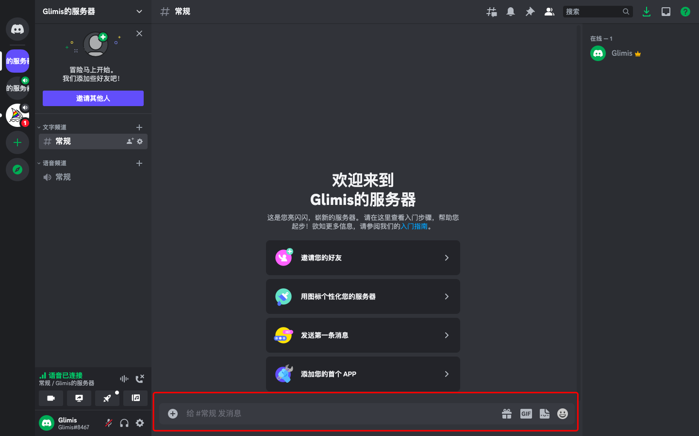

### 底部有输入框

Discord服务器底部的输入框,如红框未知,除了包含社区的基础通讯能力,还包含了很多快捷命令(此处只介绍`/`)

### 输入/有额外命令

当输入`/`时,会在新的悬浮框中,弹出支持的命令,比如图中的`/giphy`命令

> `giphy`是一款 GIF 搜索引擎,`tenor`类似,即内置的`斗图插件`

### 选择命令可获得额外能力

比如选择`giphy`,输入`thank`,就会出现相关的图片

### 可以拓展/的额外命令

`Discord`中可以拓展这种能力,只需要添加对应的`机器人`即可
