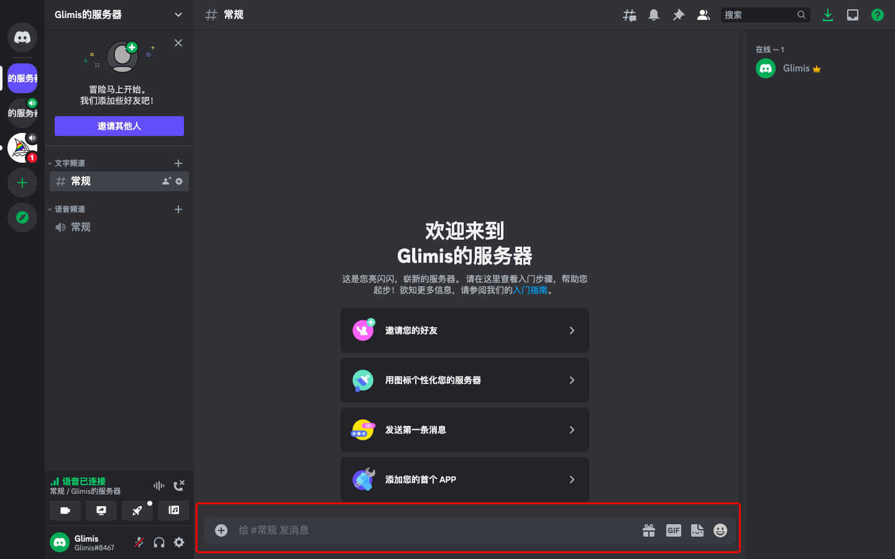
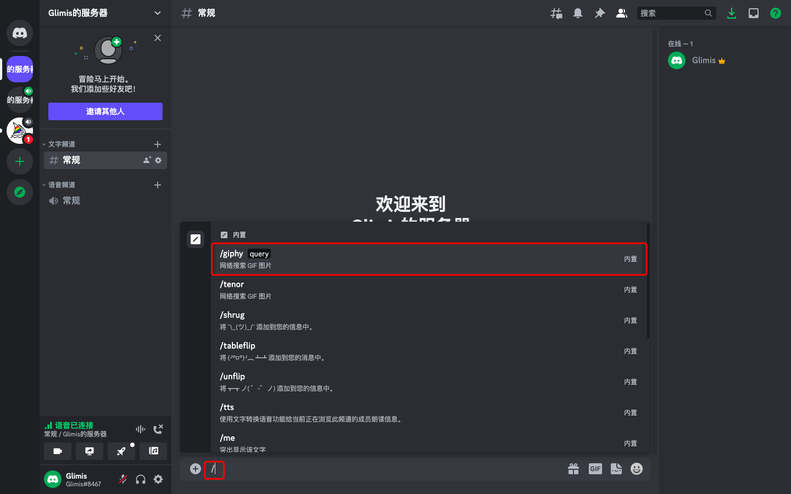

::: warning 
本章简单的描述了`Midjourney Bot`与`聊天室`的关系
:::

Discord服务器底部的输入框,除了包含社区的基础通讯能力,还包含了很多快捷命令(此处只介绍`/`)

当输入`/`时,会在新的悬浮框中,弹出支持的命令,比如图中的`/giphy`命令

> `giphy`是一款 GIF 搜索引擎,`tenor`类似,即内置的`斗图插件`

比如选择`giphy`,输入`thank`,就会出现相关的图片

在`Discord`中,如果需要对这些命令进行拓展,需要添加`机器人`。

