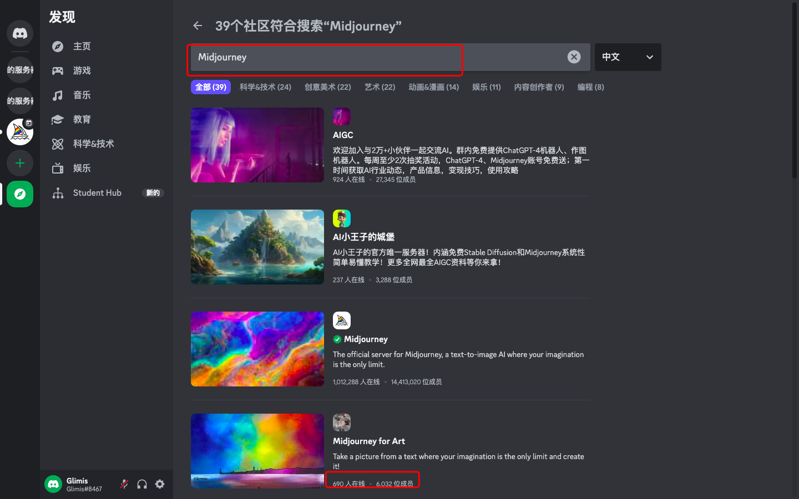

::: warning 
如果没有公共群,可通过以下方式进行加入

邀请`Midjourney Bot`的步骤与上一章相同
:::

- <a href="https://discord.com/invite/midjourney" target="__blank">https://discord.com/invite/midjourney</a>

通过邀请可直接加入

- 通过`探索可发现的服务器`寻找

点击图中1号位的`探索可发现的服务器`,找到选择2号位的公共群即可

::: warning 
大群人多,可能无法进入,可使用其他群进行平替
:::

- 三方群平替

1. 在`探索可发现的服务器`输入关键字`Midjourney`

2. 找人数少的群,加入

::: warning 
图中描述的三方群只是事例,大多数相关的群都是有的
:::
