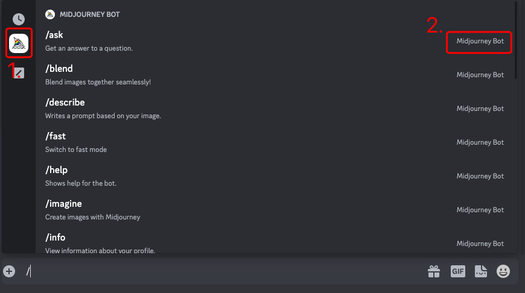

由`Midjourney Bot`提供的额外指令

1.号位为`Midjourney Bot`提供的指令集合

2.号位描述了指令来源,以此区分相同指令名

 

| 指令 | 功能 | 
| --- | --- | 
| /ask | 向系统咨询问题，系统会弹出答案和提示 | 
| /blend | 融图，上传多张（2-5张）图片，系统会将其融合为一张 | 
| /describe | 图片生成提示词，上传一张图片，系统会生成四段提示词 | 
| /fast | 切换到快速模式 | 
| /info | 查看账户信息 | 
| /settings | Midjourney机器人生成图片相关的设置 | 
| /imagine | 绘图命令 | 
| /help | 向系统求助，系统会弹出新人快速指南 | 
| /invite | 获得一个Midjourney Discord服务器的邀请链接 | 
| /prefer option set | 设置自定义选项，比如设置自定义后缀参数 | 
| /prefer auto_dm | 设置完成的任务会自动发送到私信 | 
| /prefer suffix | 设置提示词后缀 | 
| /prefer remix | 开启/关闭混音模式 | 
| /private | 切换到隐身模式（仅专业版会员） | 
| /public | 切换到公共模式 | 
| /relax | 切换到放松模式 | 
| /show | 通过人物ID恢复指定图片 | 
| /stealth | 切换到隐身模式（仅专业版会员） | 
| /subscribe | 订阅Midjourney会员 | 

