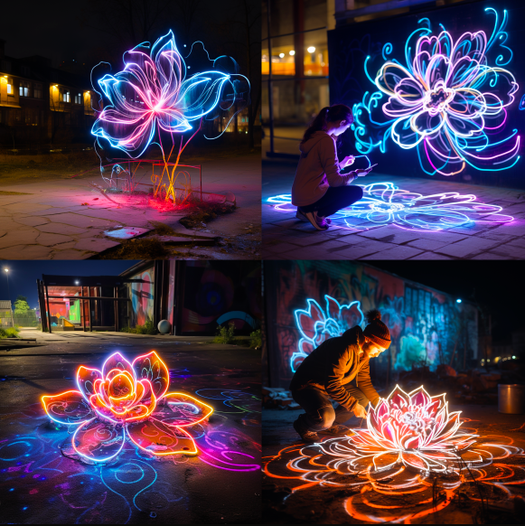
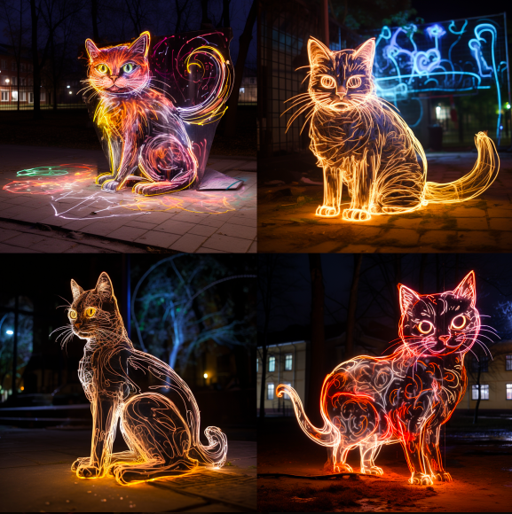

> 光影涂鸦通常也被人们称为光绘画、光涂鸦和光电涂鸦，是一种在夜晚或黑暗的房间移手持式光源或相机产生光成图效果的摄影技术。在大多数情况下，光源并不一定要出现在作品中。依靠光线移动制造出妙不可言的形象，光电涂鸦艺术由此诞生。这项诞生于街头的表演艺术，现在已经在世界范围内掀起热潮。

光涂鸦的爽点还是在过程上

## 资料

<a href="https://baike.baidu.com/item/%E5%85%89%E5%BD%B1%E6%B6%82%E9%B8%A6/456210?fr=ge_ala" target="__blank">光影涂鸦(百度百科)</a>

<a href="https://www.bilibili.com/video/BV1BP411T7W8/?spm_id_from=333.337.search-card.all.click&vd_source=3e241664c61eb5352df969fe54bdc345" target="__blank">光影涂鸦(B站)</a>

## 关键词
默认是在晚上

> On the playground, at night, draw a flower with light graffiti 

> On the playground, at night, draw a cat with light graffiti 

