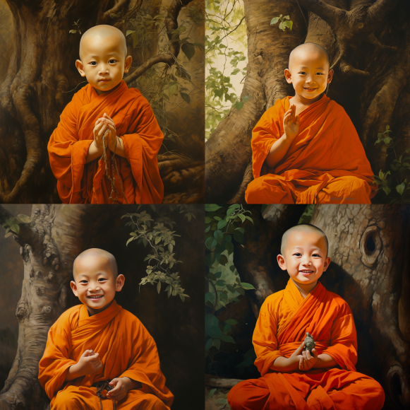
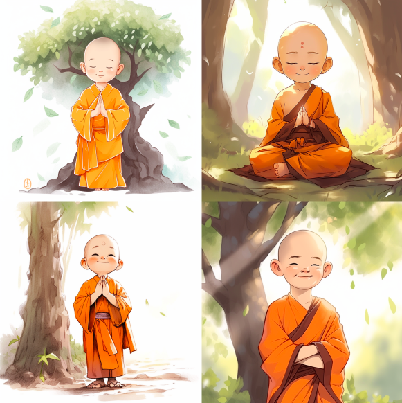
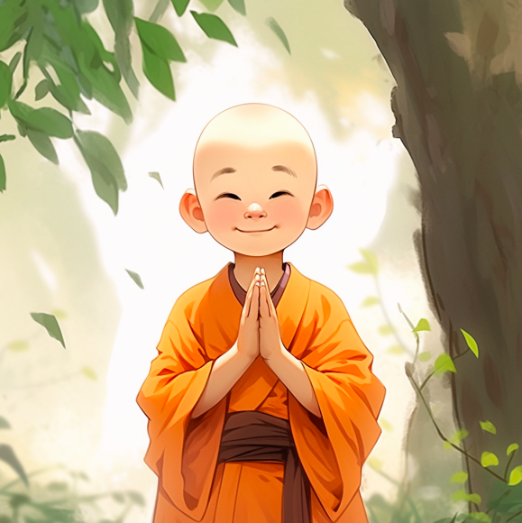

小和尚说禅语

## 1. 搭建场景

> 中国儿童和尚,穿橘色的衣服,双手合十,{寺院外,菩提树下,寺院内},正面,微笑

> Chinese child monk, wearing orange clothes, hands folded, {temple, under the Bodhi tree, inside the temple}, facing, smiling  

## 2. 风格选择
> Chinese child monk, wearing orange clothes, hands folded, temple, facing, smiling,{Realism,chinese ink style,Animation}

或者直接换模型

> Chinese child monk, wearing orange clothes, hands folded, temple, facing, smiling  --niji 

## 3. 选图

这种选图一定要用`repeat`

> Chinese child monk, wearing orange clothes, hands folded, temple, facing, smiling  --niji --repeat 5

## 4. 微调
略

