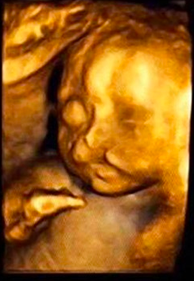
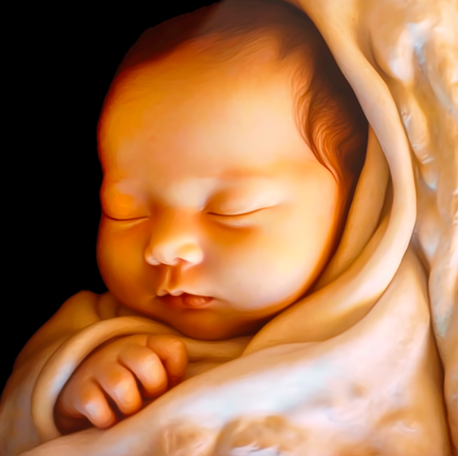

图生图模式,将四维宝宝图,转换为出生图

## 0. 上传图片,并获取图片地址

https://cdn.discordapp.com/attachments/1127070546497130620/1138674563400613958/WX20230708-184107.png

## 1. 搭建场景

需要描述这张的图组合,包括`初生儿,闭眼,面向右,抬起右手`

- 没有衣服是敏感词,需要选个衣服或者襁褓,不选默认,也有可能出现光着的

- 背景需要特殊处理,否则会出现脏东西

- 手一直都很难

> https://cdn.discordapp.com/attachments/1127070546497130620/1138674563400613958/WX20230708-184107.png A newly born Chinese baby , closed eyes, side view, grip right hand, with right hand, fair skin, rosy complexion, lying on the crib, dressed in white swaddling clothes. Against a dreamy white background, some light shines in from the side 

## 2. 抽卡
repeat抽卡

主要是手和背景的问题,

