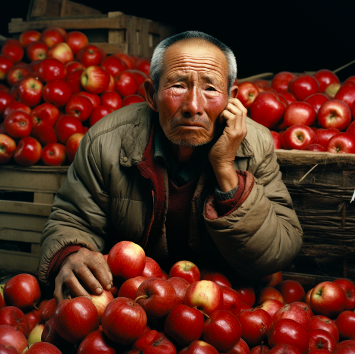
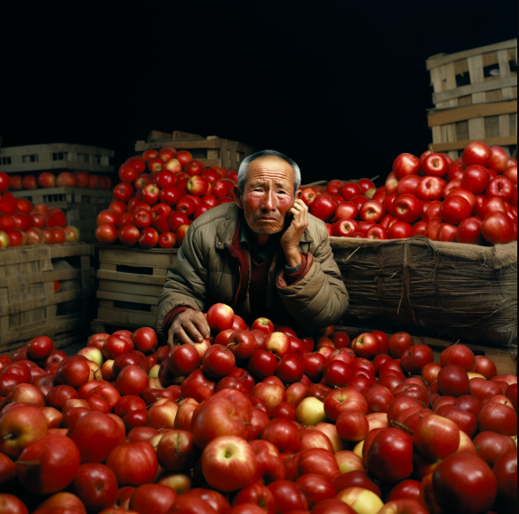
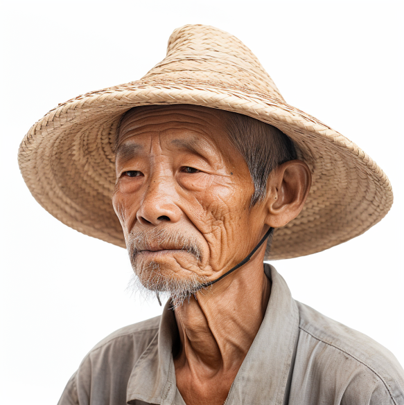
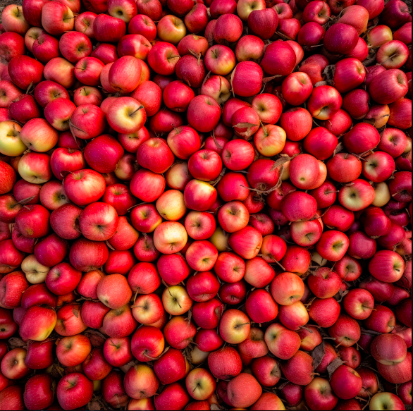

xx滞销,救救爷爷

两种方式,一种是Zoom Out微调,另一种是两张图 大背景+爷爷,后期自己合成

# Zoom Out 拓展
内容太杂,很不好处理,基本靠抽卡

## 1. 搭建场景

> 很多苹果，中国农民，60岁，哭泣

> Many apples , Chinese farmer, 60 years old, crying --repeat 10

## 2. Zoom Out微调
U系列后,使用Zoom Out调整大小

# 背景图 + 爷爷图

单一内容的描述,mj的主战场

## 爷爷图
侧脸图,细节直接拉满

> 中国农民,60岁,皱纹,绝望,侧视图,白底

> Chinese farmer, 60 years old, A wrinkled face,despair, straw hat,side view ,white background --repeat 10

## 苹果图
鸟瞰图,效果直接拉满

> 很多苹果,鸟瞰图

> A lot of apples piled together, prospect,Aerial view

自行合成即可